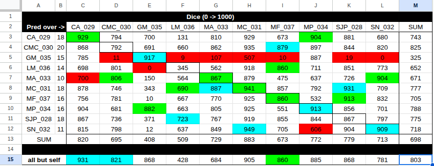
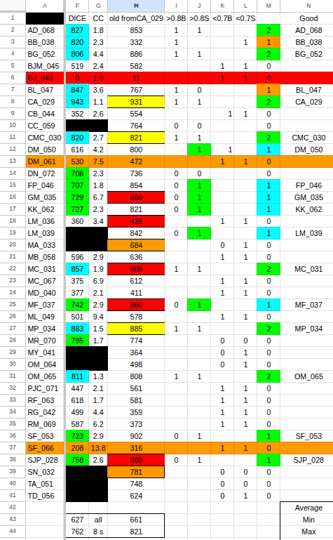
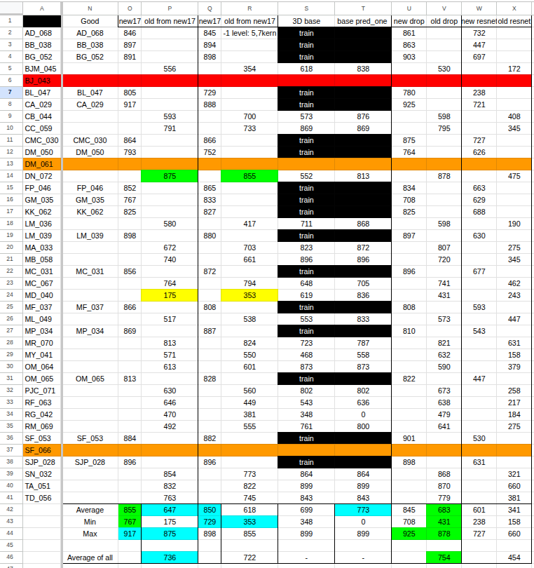
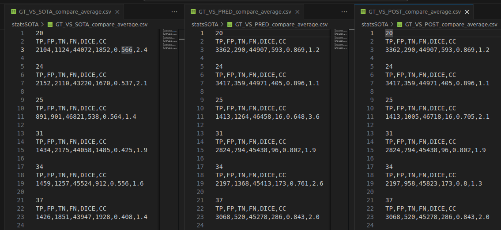

## Contexte du projet

L’objectif de cette étude est d’explorer la faisabilité de la **segmentation automatique du foie** à partir des images **display_map**.

Ces images ne sont pas des échos IRM bruts : elles sont déjà **calculées à partir des différents échos de gradient et de spin** issus d’une acquisition IRM.

Contrairement aux échos individuels, dont les caractéristiques (luminosité, contraste, contours) dépendent fortement de la puissance de l’IRM utilisée, les **display_map** présentent une **homogénéité de nature** :

- luminosité et contraste relativement stables,
- contours mieux définis,
- indépendance vis-à-vis de la puissance de l’IRM (la seule variation notable étant la **résolution**, et donc la taille des images).

## Objectifs

- Vérifier dans quelle mesure les **display_map** permettent une segmentation automatique qualitative du foie.
- Identifier les méthodes qui fonctionnent et celles qui échouent, afin d’en déduire :
    - des stratégies d’apprentissage adaptées,
    - des pistes d’amélioration du processus d’acquisition.
- Fournir un **code source réutilisable** en ligne de commande, permettant :
    - l’entraînement de modèles,
    - la prédiction sur de nouvelles images,
    - l’utilisation de réseaux déjà entraînés.
- Documenter les **résultats obtenus** avec les approches testées.

## Technologies utilisés

- **Langage** : Python
- **Framework** : PyTorch

---

## Arborescence générale

```
project/
│
├── _datasets/          # Données et normalisation
│   ├── *.py            # Scripts de normalisation
│   ├── *.dcm           # Datasets normalisés 2D (IRM)
│   └── *.tif           # Datasets normalisés 3D
│
├── _run/               # Scripts principaux d’entraînement et de prédiction
│   └── *.py
│
├── pred/               # Prédictions générées
│   ├── *.png           # Prédictions 2D
│   └── *.tif           # Prédictions 3D
│
├── post/               # Post-traitement des prédictions
│   └── *.tif           # Prédictions 3D après traitement
│
├── stats/              # Évaluation par rapport aux segmentations manuelles
│   └── *.csv
│
├── statsSOTA/          # Évaluation par rapport à l’état de l’art
│   └── *.csv
│
├── train/              # Réseaux de neurones entraînés (poids)
│   └── *.pt
│
└── launch.py           # Liste des commandes pour reproduire les résultats du tableau 1
└── launchExtended.py   # Liste des commandes pour reproduire les résultats du tableau 2
└── launchNew17.py      # Liste des commandes pour reproduire les résultats du tableau 3
└── oneCC.py            # ...
└── launchPost.py       # ...
└── batchCompareTS.py   # Liste des commandes pour reproduire les résultats du tableau 4
```

## Déroulement des expérimentations

Accès à 10 stacks : 

```
CA_029, CMC_030, GM_035, LM_036, MA_033, MC_031, MF_037, MP_034, SJP_028, SN_032.
```

- Normalisation des données :
    - _datasets/clean.py
- Création de deux splits (dans _datasets/):
    - toSelf/ : 
    3 images test par stack / reste du stack en train 
    ⇒ Pas vraiment représentatif.
    - butSelf/ : 
    1 stack entier pour les test / les autres stacks pour le train 
    ⇒ Plus représentatif (156 images utilisées : incluant +/- 15 pour les test)



- La ligne 15 représente les dice score des prédictions après entraînement via butSelf/. 
(Ex : D15 est le dice score entraîné sur tous les stacks sauf CMC_030, et prédit sur toutes les images du stack CMC_030)
    - stats/butSelf_compare_average.csv
- La diagonale C3 → L12 représente les dice score des prédictions après entraînement via toSelf/, les prédictions sont réalisées sur les 3 images de test d’un stack, l’entraînement sur le reste du stack.
    - stats/toSelf_compare_average.csv
- Les lignes 3 à 12 représentent les dice score des prédictions après entraînement via toSelf/,  les prédictions sont réalisées sur les 3 images de test d’un stack (en-tête colonne), l’entraînement sur les images d’entraînement d’un autre stack (en-tête ligne). 
(Ex : D3 est le dice score entraîné sur CA_029, prédit sur les 3 images de test de CMC_030)
    - stats/toOthers_CA_029_compare_average.csv
    - …
    - stats/toOthers_SN_032_compare_average.csv

---
Accès à 30 stacks supplémentaires :

- Normalisation des données :
    - _datasets/extendedClean.py
- Exclusion de 3 stacks inutilisables : BJ_043, DM_061, SF_066.
- Création d’un split (dans _datasets/):
    - extendedButSelf/ : 
    Même chose, 1 stack entier pour les test / les autres stacks pour le train 
    ⇒ Plus représentatif (587 images utilisées : toujours incluant un stack +/- 15 pour les test)



- La colonne F représente les dice score des prédictions après entraînement via extendedButSelf/. 
(Ex : F11 est le dice score entraîné sur tous les stacks sauf CMC_030, et prédit sur toutes les images du stack CMC_030)
    - stats/extendedButSelf_compare_average.csv
- La colonne H représente les dice score des prédictions après entraînement via butSelf/ (donc avec seulement 156 images). Report des valeurs du tableau précédent (ligne 15) pour les 10 déjà prédits, prédictions via butSelf/ entraîné sans accès à CA_029 pour les autres.
(Ex : F2 est le dice score entraîné sur les 9 stacks précédents (butSelf/) sauf CA_029, et prédit sur toutes les images du stack AD_068).
    - stats/fromOldCA_029_compare_average.csv

Constatation expérimentale :

- L’utilisation de 156 images pour l’entraînement amène en moyenne à de meilleurs résultats que l’utilisation de 587 images.
    - F43 < H43 : moyenne des prédictions sur les 30 nouveaux stacks.
    - F44 < H44 : moyenne des prédictions sur les 10 anciens stacks.

Hypothèse : 

- Certains stacks dégradent les performances de l’entraînement.

---
Création d’un nouveau split (dans _datasets/):

- new17ButSelf/ : 
Même chose, 1 stack entier pour les test / les autres stacks pour le train 
⇒ Plus spécifique (290 images utilisées : toujours incluant un stack +/- 15 pour les test)
- Colonne N :  les 17 stacks (290 images) qui ont été prédit au dessus de 800 de dice par au moins un des 2 butSelf (utilisant 156 images, ou utilisant 587 images)

Expérimentations avec différentes architectures de réseaux de neurones :



- O & P : _run/models/unets.py : **baseVessels**
    - O : new17ButSelf_compare_average.csv
    - P : new17ButSelf_others_compare_average.csv

- Q & R : _run/models/unets.py : **NewKernel**
(1 étage de moins : 512 , 3 et 3 devient 5 et 7 sur les doubleBlocks de conv
    - Q : new17ButSelf_kernel_compare_average.csv
    - R : new17ButSelf_kernel_others_compare_average.csv

- U & V : _run/models/unets.py : **baseVessels_drop**
    - U : new17ButSelf_baseDrop_compare_average.csv
    - V : new17ButSelf_baseDrop_others_compare_average.csv

- W & X : _run/models/imported.py : **resnet50_last (frozen but last)**
    - W : new17ButSelf_resnet50_compare_average.csv
    - X : new17ButSelf_resnet50_others_compare_average.csv

On peut constater que : 

- Sur les 17 meilleurs, 855 de dice moyen 767 de minimum, il n’est pas intéressant d’essayer d’améliorer la segmentation par apprentissage profond, considérant le manque de précision de la segmentation manuelle.
- Sur les 20 restants, le dice moyen est faible dans tous les cas.

---
Création d’un nouveau split (dans _datasets/) : Passage à la 3D

- stacks/
    - 17 stacks servent à l’entraînement, le reste est prédit (on ne prédit plus que les anciennement mal prédits).

Expérimentations en 3D

- S & T : _run/models/unets.py :  Liver3D (tableau précédent)
    - S : stats/3D_20_bad_compare_average.csv (<= équivalent à =>)  stats/post_pred_compare_average.csv
    - T : Conservation de la plus grosse composante connexe en 3D.
        - stats/post_pred_one_compare_average.csv

Résultat final :

- T42 : 773 de dice moyen sur les 20 mauvais.

- Pour réaliser des nouvelles prédictions, utiliser : ```train/stacks/liver3D/allBN.pt```

Comparaison à  https://github.com/wasserth/TotalSegmentator

- Sur les 20, seuls 6 sont correctement prédit sur l’ensemble des 16 slices données:
    
    
    

TotalSegmentator : Dice minimum : 408 - Dice maximum : 566 

- statsSOTA/GT_VS_SOTA_compare_average.csv

Méthode proposée (prédiction) : Dice minimum : 648 - Dice maximum : 896

- statsSOTA/GT_VS_PRED_compare_average.csv

Méthode proposée (avec post-processing) : Dice minimum : 705 - Dice maximum : 896

- statsSOTA/GT_VS_POST_compare_average.csv
---
